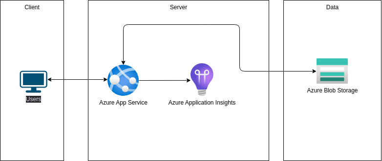

# ABIChallenge_YamilMorfa
AB InBev MLOps Challenge Yamil Ernesto Morfa

## Overview
This project implements a simple Flask API to classify Iris species using a pre-trained machine learning model. The API predicts the species based on the input features provided, such as sepal length, sepal width, petal length, and petal width.

## Steps to Develop the Project

### 1. Model Creation
The initial step involved creating a Jupyter Notebook to train and test the machine learning model.

- Notebook: `notebooks/IrisClassification.ipynb`
- In this notebook, I loaded the Iris dataset, trained a model, and evaluated its performance.
- After ensuring the model was working correctly, I saved it as `iris_model.pkl` to be used in the backend API.

### 2. Backend API Development
Next, I created a Flask application to serve the predictions through an API.

The main application file is located at `backend/app.py`.
I created an API endpoint `/predict` to accept POST requests with the required input features in JSON format and return the predicted species.

### 3. Unit Testing
I implemented unit tests to verify that the API behaves as expected. The test file is located at tests/test_app.py.
I created tests for both successful predictions and invalid input handling.


### 4. Docker Configuration
To facilitate local development and deployment, I configured Docker for the project.

- **Dockerfile**: Defines the environment for the Flask application.
- **docker-compose.yml**: Allows for easy management of the application's services.


### 5. Continuous Integration and Deployment (CI/CD)
I set up a CI/CD pipeline using GitHub Actions to automate testing and deployment.

- The workflow file is located at `.github/workflows/ci-cd.yml`.
- The pipeline includes steps for:
  - Running unit tests.
  - Building the Docker image.
  - (Future) Deploying to Azure App Service.


### File Structure
```bash
root
├── docker-compose.yml  
├── Dockerfile 
├── .gitignore
├── requirements.txt      # Dependencies requirements    
├── README.md
├── backend/
│   ├── app.py                # Main Flask app
│   ├── model/
│   │   └── iris_model.pkl    # Pre-trained model
│   ├── routes/
│   │   └── predict.py        # Prediction route handler
│   ├── services/
│   │   └── prediction_service.py # Business logic
│   ├── templates 
│   │   ├── home.html
│   │   ├── index.html
│   │   └── result.html
│   └── statics
│       └── images
│           └── iris.png 
├── notebooks
│   └── IrisClassification.ipynb # model experimentations
├── tests
│   └── test_app.py # Unit Testing to verify that the API behaves as expected

```

## Step by step guide to run

### 1. Clone this repo

```bash 
git clone <repo_url>
cd <repo_name>
```

### 2. Install requirements (Ubuntu)

```bash
python3 -m venv .venv
source .venv/bin/activate
python -m pip install --upgrade pip
pip install -r requirements.txt
```

### 3. Run the Flask Application
```bash
python backend/app.py
```

### 4. Run Tests (Optional)
You can run the unit tests to ensure everything is functioning correctly:
```bash
python -m unittest discover -s tests
```

### 5. Using Docker (Optional)
To run the application using Docker, build and run the container:
```bash
docker-compose up --build
```

## Future Work
- Consider integrating SonarCloud for code quality analysis.
- Implement deployment to Azure App Service for a production-ready environment.

